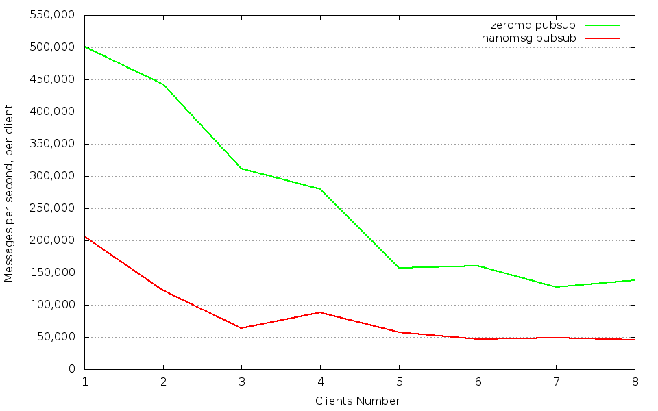
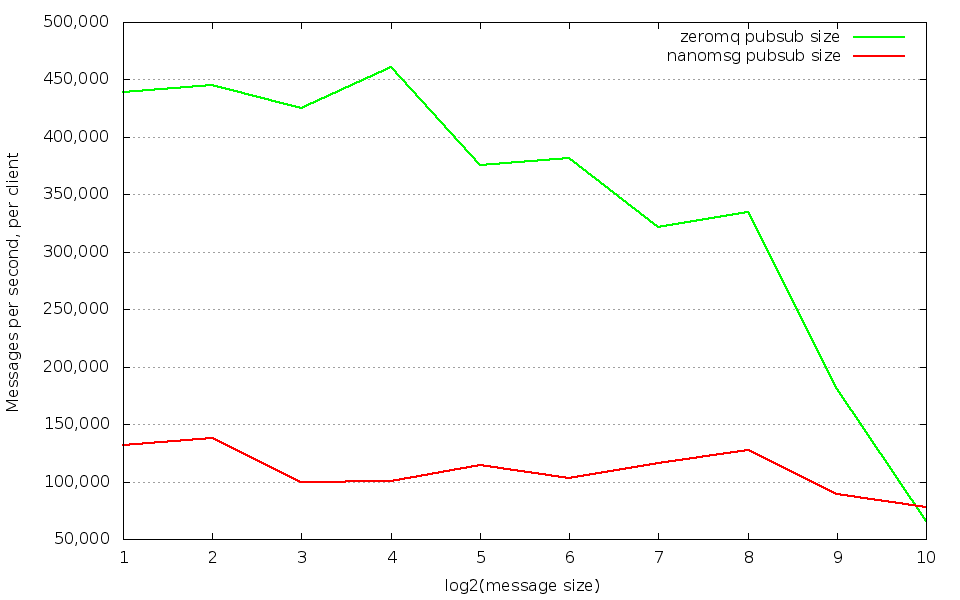

## Nanomsg vs 0MQ performance benchmark

## Publish-subscribe perf

### Dependency

* [libzmq](https://github.com/zeromq/libzmq)
* [czmq](https://github.com/zeromq/czmq)
* [libnanomsg](https://github.com/nanomsg/nanomsg)
* [gnuplot](http://www.gnuplot.info/)

### Build & Run benchmark

    make
    ./build/nanomsg_pubsub_broker -r5000 -s5001 &
    ./build/zmq_pubsub_broker -r6000 -s6001 &
    python bench.py

### Sample benchmark results

Run broker, publisher and subscriber on a same machine with 4-core cpu Intel Xeon E5-2640 0 @ 2.50GHz, 30GB memory.
The host os is Ubuntu 12.04.4 LTS X86_64 with Linux kernel 3.5.0-23.
Besides the result below doesn't make any performance tuning.

Benchmark comparison when changing clients from 1 to 8

Benchmark comparison when changing message from 2 to 1024, doubled each time

